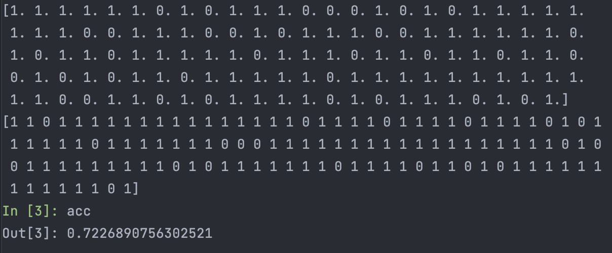

# Clash Royale Matchup Predictor
NOTE: **THIS PROJECT IS STILL IN PROGRESS**  (basically done, but lots of improvements)

I am making this project on my own, for fun (and because I wasted a lot of time on the game in middle school). 

I'm also using this as a chance to learn HTML & CSS from scratch 

## Overview:
### Clash Royale:
Clash Royale is a real-time, 1v1 battle against other players. You and your opponents both build a deck of 8 cards. 
The aim is to destroy opponent towers while defending your own. Match time is 3 minutes with 2 minutes extra time. 
Destroying king tower wins the game (unless your opponent destroys your king tower at the same time, resulting draw). 
Otherwise, the player with more damage / crowns wins the game.

### Problem:
The game is not fair sometimes, it's kind of like rock-paper-scissors, where one deck could hard counter another deck.
I am building this model to predict the likelihood of one deck beating another deck. 

### Assumptions:
There are a few assumptions I am making:
  - ~~Both players have the same knowledge on the game (eg. card interactions)~~ Okay, after some playing around, I have to include the players experience with the game as a factor to consider.
  - ~~Players do not make "stupid" mistakes~~ Not true, even our training data does not gurantee this
  - ~~There aren't any "broken" cards~~ With the new update, evolutions, there are very broken cards, and I think they're reflected in the data. (This entire point kinda makes the game not fair)


## Data Collection:
### Collecting:
Since I haven't found any data publicly online I decided to generate my own data.
I generated my own API Token from Clash Royale: https://developer.clashroyale.com/#/

I couldn't find specific league season history for recent months, hence I am using 2022-08, the latest history of top 10,000
players. I navigated to the player history (battle). 
From there, I collected three information. 
- Player Deck
- Opponent Deck
- Outcome of the match (WIN or DEFEAT for player)

Then, I stored the results into a csv file, ~~there are approximately 130,000 entries.~~,
right now, the new version, there are only around 550 entries, as it takes forever to generate them.

As of September 7, I have included more info, an entry would look something like this:
```
879,11,-2,10,"['Knight', 'Princess', 'Ice Spirit', 'Goblin Gang', 'Tesla', 'Rocket', 'Goblin Barrel', 'The Log']","['Royal Recruits', 'Royal Hogs', 'Arrows', 'Goblin Cage', 'Flying Machine', 'Zappies', 'Fireball', 'Barbarian Barrel']",True
```
From left to right:
```
delta_pb, delta_max_win, delta_rank, delta_gt, blue_cards, red_cards, won?
```

Before, the aim was to see if Deck A beats Deck B, now its shifted more, **can player A beat player B, given their history and deck choices**. Of course, if we input the same stats for players, then we will still be looking at "Can Deck A beat deck B?"


### Cleaning:
I did not consider any battles of the player that were not 1v1 pathOfLegend type.
pathOfLegend is the new "ranked" mode. This is to ensure consistency, where other modes
player could player for "fun", causing many outliers. 

### Learning (so far, lots more to do as I learn more about ML):
I wrote a two layer neural network, with input size 20, then input size 8 to the second layer and then finally and output of size 1. 
Why neural network? Well, maybe I could use a decision tree or random forests (too many parameters and then decision boundary too complex). But the complexity of decks will probably mean overfitting. I played around a bit and found out Probabilistic models performed very poorly.
Logistic regression had an accuracy around 60%. There are too many complex patterns that I could not see
, as I learned in my intro ML class, if your reduce any problem into a function, a neural network, in theory
can solve anything, so I gave it a try. 

**Please note that, I have not tuned any hyperparmeters in this new version yet**

#### Version that failed miserably 
This is actually my second attempt, at first I had a model that accepts an input size (109 x 2). Basically an encoding of cards
of both players. I thought about it and I feel like the data, reflected by real players vary in different skills.
So my assumptions about equal skills, not misplays etc, are all invalid, and caused the model to perform awful.
I think it was too complex, so it just kept overfitting, sometimes just predicting the same outcome, no matter the input.

So I think, to predict the outcome of a match, the player must be taken account, hence the new version. 
### Simple version
Through this simple version (small dataset, random hyperparmeters) I achieved a 72.27% accuracy. 
So far, its not just predicting the same outcome no matter the input, which is good. I shall - tune hyperparameters and think a bit more
how to improve this further.



